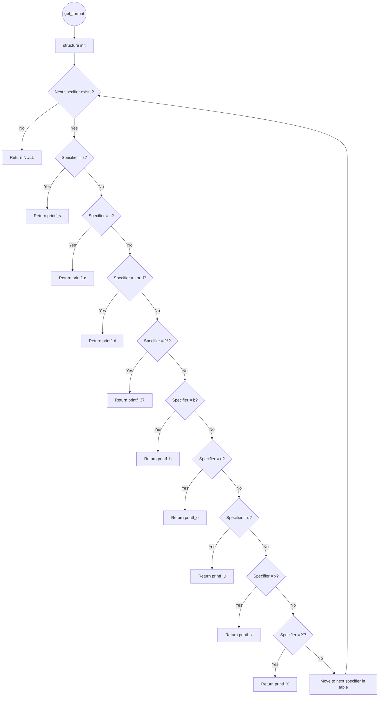

```mermaid
flowchart TD
    Start((get_format)) --> Init[structure init]
    Init --> CheckNext{Next specifier exists?}
    CheckNext -->|No| ReturnNull[Return NULL]
    CheckNext -->|Yes| Specifier_s{Specifier = s?}

    %% --- s ---
    Specifier_s -->|Yes| Click_s[Return printf_s]
    click Click_s "https://github.com/tomvieilledent/holbertonschool-printf/blob/main/flowchart/printf_s.md" "Flowchart printf_s"
    Specifier_s -->|No| Specifier_c{Specifier = c?}

    %% --- c ---
    Specifier_c -->|Yes| Click_c[Return printf_c]
    click Click_c "https://github.com/tomvieilledent/holbertonschool-printf/blob/main/flowchart/printf_c.md" "Flowchart printf_c"
    Specifier_c -->|No| Specifier_id{Specifier = i or d?}

    %% --- i/d ---
    Specifier_id -->|Yes| Click_id[Return printf_d]
    click Click_id "https://github.com/tomvieilledent/holbertonschool-printf/blob/main/flowchart/printf_d.md" "Flowchart printf_d"
    Specifier_id -->|No| Specifier_percent{Specifier = %?}

    %% --- % ---
    Specifier_percent -->|Yes| Click_percent[Return printf_37]
    click Click_percent "https://github.com/tomvieilledent/holbertonschool-printf/blob/main/flowchart/printf_37.md" "Flowchart printf_37"
    Specifier_percent -->|No| Specifier_b{Specifier = b?}

    %% --- b ---
    Specifier_b -->|Yes| Click_b[Return printf_b]
    click Click_b "https://github.com/tomvieilledent/holbertonschool-printf/blob/main/flowchart/printf-b.md" "Flowchart printf_b"
    Specifier_b -->|No| Specifier_o{Specifier = o?}

    %% --- o ---
    Specifier_o -->|Yes| Click_o[Return printf_o]
    click Click_o "https://github.com/tomvieilledent/holbertonschool-printf/blob/main/flowchart/printf_o.md" "Flowchart printf_o"
    Specifier_o -->|No| Specifier_u{Specifier = u?}

    %% --- u ---
    Specifier_u -->|Yes| Click_u[Return printf_u]
    click Click_u "https://github.com/tomvieilledent/holbertonschool-printf/blob/main/flowchart/printf_u.md" "Flowchart printf_u"
    Specifier_u -->|No| Specifier_x{Specifier = x?}

    %% --- x ---
    Specifier_x -->|Yes| Click_x[Return printf_x]
    click Click_x "https://github.com/tomvieilledent/holbertonschool-printf/blob/main/flowchart/printf_x.md" "Flowchart printf_x"
    Specifier_x -->|No| Specifier_X{Specifier = X?}

    %% --- X ---
    Specifier_X -->|Yes| Click_X[Return printf_X]
    click Click_X "https://github.com/tomvieilledent/holbertonschool-printf/blob/main/flowchart/printf_X.md" "Flowchart printf_X"
    Specifier_X -->|No| Next[Move to next specifier in table]

    %% Loop
    Next --> CheckNext
```