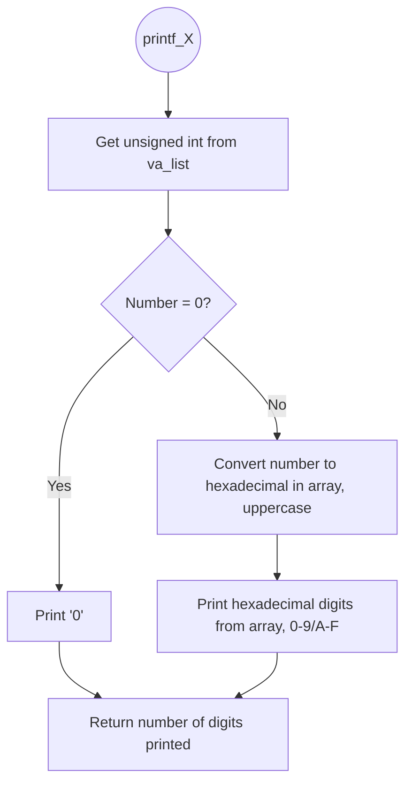

```mermaid
flowchart TD
    Start_X((printf_X)) --> GetNumber[Get unsigned int from va_list]
    GetNumber --> CheckZeroXX{Number = 0?}
    
    CheckZeroXX -->|Yes| PrintZeroXX[Print '0']
    PrintZeroXX --> End_X[Return 1]
    
    CheckZeroXX -->|No| ConvertHexX[Convert number to hexadecimal in array, uppercase]
    ConvertHexX --> PrintHexX[Print hexadecimal digits from array, 0-9/A-F]
    PrintHexX --> End_X[Return number of digits printed]
```