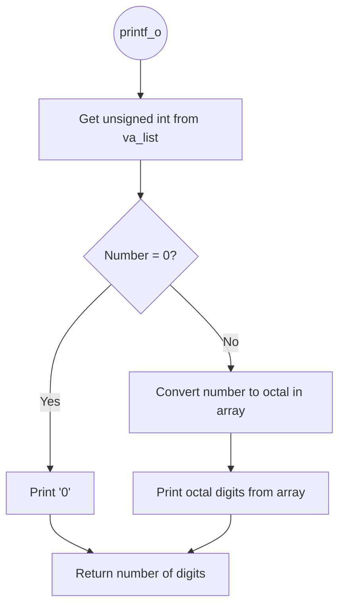

```mermaid
flowchart TD
    Start_o((printf_o)) --> GetNumber[Get unsigned int from va_list]
    GetNumber --> CheckZero{Number = 0?}
    
    CheckZero -->|Yes| PrintZero[Print '0']
    PrintZero --> End_o[Return 1]
    
    CheckZero -->|No| ConvertOctal[Convert number to octal in array]
    ConvertOctal --> PrintOctal[Print octal digits from array]
    PrintOctal --> End_o[Return number of digits]
```