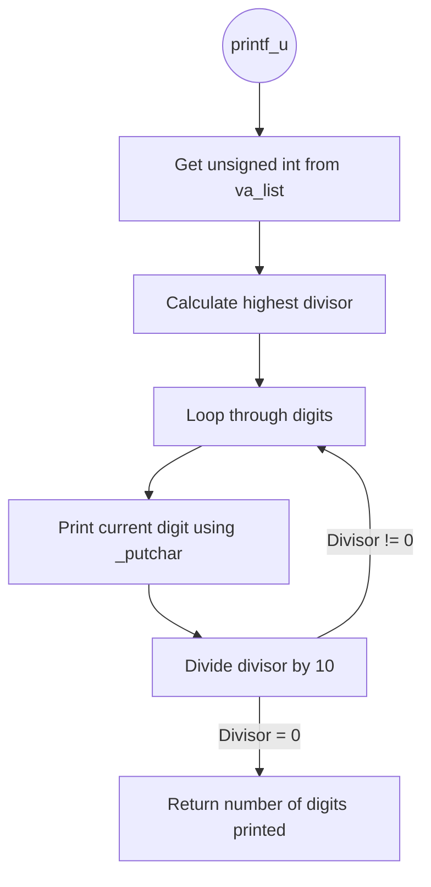

```mermaid
flowchart TD
    Start_u((printf_u)) --> GetNumber[Get unsigned int from va_list]
    GetNumber --> CalcDivisor[Calculate highest divisor]
    CalcDivisor --> LoopDigits[Loop through digits]
    LoopDigits --> PrintDigit[Print current digit using _putchar]
    PrintDigit --> UpdateDivisor[Divide divisor by 10]
    UpdateDivisor -->|Divisor != 0| LoopDigits
    UpdateDivisor -->|Divisor = 0| End_u[Return number of digits printed]
```