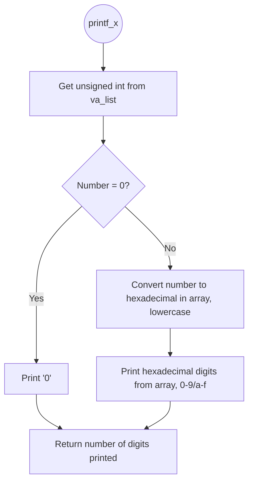

```mermaid
flowchart TD
    Start_x((printf_x)) --> GetNumber[Get unsigned int from va_list]
    GetNumber --> CheckZeroX{Number = 0?}
    
    CheckZeroX -->|Yes| PrintZeroX[Print '0']
    PrintZeroX --> End_x[Return 1]
    
    CheckZeroX -->|No| ConvertHex[Convert number to hexadecimal in array, lowercase]
    ConvertHex --> PrintHex[Print hexadecimal digits from array, 0-9/a-f]
    PrintHex --> End_x[Return number of digits printed]
```